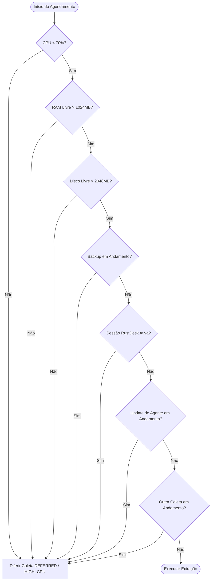

import { Callout } from 'fumadocs-ui/components/callout';
import { Steps, Step } from 'fumadocs-ui/components/steps';

<Callout type="info">
  O módulo de coleta do agente reside em `apps/agent/internal/analytics/` e é projetado para operar com prioridade mínima no sistema operacional, garantindo **zero degradação** da máquina do cliente.
</Callout>

## Estrutura do Módulo Go

```text
apps/agent/internal/analytics/
├── application/
│   ├── scheduler.go           # Orquestrador de agendamentos e janelas
│   ├── sync_dataset.go        # Fluxo de sincronização incremental
│   ├── backfill_dataset.go    # Carga de histórico fracionada
│   ├── reconcile_dataset.go   # Reconciliação noturna/semanal
│   ├── create_batch.go        # Geração e empacotamento de lotes
│   ├── upload_batch.go        # Envio comprimido HTTP ao Portal
│   └── report_status.go       # Telemetria do coletor para o backend
│
├── domain/
│   ├── dataset.go             # Entidades de datasets e schemas
│   ├── policy.go              # Regras de execução e Resource Budget
│   ├── batch.go               # Modelo de lote e metadados
│   ├── sync_state.go          # Estado local da sincronização
│   ├── watermark.go           # Marcas d'água de datas/períodos
│   ├── resource_budget.go     # Verificador de CPU, RAM e Disco
│   └── errors.go              # Tipos de erro e códigos de diferimento
│
└── infrastructure/
    ├── syspro_api/            # Conector HTTP/IIS da API local Syspro
    ├── sqlite/                # Driver e repositório SQLite (analytics.db)
    ├── filesystem/            # Gerenciamento de staging e filas de arquivos
    ├── compression/           # Compactador GZip/ZSTD de payloads
    ├── portal_client/         # Cliente de ingestão da API NestJS
    └── resource_monitor/      # Leitor de métricas do sistema operacional
```

---

## Contrato do Extrator (`DatasetExtractor`)

Todos os extratores do agente implementam a interface `DatasetExtractor`:

```go
package domain

import "context"

type ExtractRequest struct {
	SysproInstallationID string
	CompanyCode          string
	PeriodFrom           string // YYYY-MM-DD
	PeriodTo             string // YYYY-MM-DD
	Limit                int
}

type ExtractResult struct {
	RowCount   int
	SizeBytes  int64
	RawPayload []byte
	Checksum   string
}

type DatasetExtractor interface {
	Name() string
	SchemaVersion() int

	Extract(
		ctx context.Context,
		req ExtractRequest,
	) (ExtractResult, error)
}
```

No MVP V1, apenas o `SalesLinesExtractor` é ativado:

```text
GET {protocol}://{host}:{port}/{basePath}/api/exporta/produto/venda?dt_inicial=YYYY-MM-DD&dt_final=YYYY-MM-DD
```

---

## Descoberta e Validação da API Local

Cada instalação do Syspro no cliente possui sua própria configuração de acesso à API local:

### Conexão Direta (HTTP Direct)
```json
{
  "installationId": "syspro-inst-001",
  "api": {
    "protocol": "http",
    "host": "127.0.0.1",
    "port": 8080,
    "mode": "DIRECT",
    "basePath": ""
  }
}
```

### Conexão via IIS (ISAPI DLL)
```json
{
  "installationId": "syspro-inst-001",
  "api": {
    "protocol": "http",
    "host": "127.0.0.1",
    "port": 8080,
    "mode": "IIS",
    "basePath": "/sysproserverisapi.dll"
  }
}
```

Antes de realizar a extração, o agente executa uma validação em 7 passos:
1. Conexão TCP no socket configurado;
2. Resposta HTTP status `200 OK`;
3. Formato JSON válido no payload de resposta;
4. Tempo de resposta dentro do limite aceitável (< 90s);
5. Quantidade e estrutura dos registros retornados;
6. Compatibilidade da versão do schema do dataset;
7. Validação do código de empresa retornado.

---

## Controle de Carga e Política de Recursos (`Resource Budget`)

<Callout type="warn">
  **Regra de Ouro**: O Analytics deve executar no máximo **1 consulta local** e **1 upload** por vez. Nenhuma paralelização de datasets é permitida.
</Callout>

### Configuração Padrão da Política de Recursos

```json
{
  "analytics": {
    "enabled": true,
    "maxConcurrentExtractions": 1,
    "maxConcurrentUploads": 1,
    "maxCpuPercent": 70,
    "maxMemoryPercent": 80,
    "minimumFreeMemoryMb": 1024,
    "minimumFreeDiskMb": 2048,
    "maximumResponseMb": 50,
    "queryTimeoutSeconds": 90,
    "maximumJobDurationMinutes": 5,
    "pauseBetweenRequestsSeconds": 10,
    "pauseDuringRemoteSession": true,
    "pauseDuringBackup": true,
    "pauseDuringAgentUpdate": true
  }
}
```

### Validação Pré-Execução

Antes de disparar qualquer requisição à API do Syspro, o `resource_budget.go` avalia a árvore de condições:



Se qualquer condição falhar, o estado da tarefa é marcado como `DEFERRED` (Diferido) sem incrementar o contador de falhas graves:

```json
{
  "state": "DEFERRED",
  "reason": "HIGH_CPU",
  "retryAfterSeconds": 300
}
```

---

## Frequência de Coleta e Reconciliação

1. **Sincronização Incremental (a cada 15 minutos)**:
   * Consulta os dados do **dia atual** e do **dia anterior** (`dt_inicial = hoje - 1`, `dt_final = hoje`).
   * A sobreposição de 1 dia é obrigatória para capturar lançamentos retroativos ou edições no ERP legado.

2. **Reconciliação Noturna (1x por noite)**:
   * Consulta os últimos **7 dias**.
   * Objetivo: Capturar notas fiscais faturadas com atraso e lotes perdidos por indisponibilidade local.

3. **Reconciliação Semanal (1x por semana)**:
   * Consulta os últimos **30 dias** (executado exclusivamente de madrugada nos finais de semana).

4. **Backfill Histórico Gradual**:
   * O histórico inicial é importado em pequenas parcelas por execução:
   * **Máximo 1 dia por execução**, **ou 50 MB**, **ou 5 minutos de duração**.
   * Nunca consulta um ano completo em uma única chamada HTTP.

---

## Buffer Local SQLite (`analytics.db`)

Todos os dados coletados e o estado de envio são gerenciados localmente através do SQLite localizado no caminho:

```text
C:\ProgramData\Trilink\Agent\analytics\
├── analytics.db
├── queue\
├── staging\
├── failed\
└── logs\
```

### Tabelas Locais

```sql
CREATE TABLE analytics_sync_state (
    dataset TEXT PRIMARY KEY,
    installation_id TEXT NOT NULL,
    last_success_at DATETIME,
    last_period_from DATE,
    last_period_to DATE,
    last_batch_id TEXT,
    last_checksum TEXT,
    next_run_at DATETIME,
    failure_count INTEGER DEFAULT 0
);

CREATE TABLE analytics_batches (
    batch_id TEXT PRIMARY KEY,
    dataset TEXT NOT NULL,
    schema_version INTEGER NOT NULL,
    company_code TEXT NOT NULL,
    period_from DATE NOT NULL,
    period_to DATE NOT NULL,
    row_count INTEGER NOT NULL,
    size_bytes INTEGER NOT NULL,
    checksum TEXT NOT NULL,
    state TEXT NOT NULL, -- STAGED, UPLOADING, CONFIRMED, FAILED
    attempts INTEGER DEFAULT 0,
    created_at DATETIME NOT NULL,
    uploaded_at DATETIME,
    confirmed_at DATETIME
);
```

### Política de Confirmação (ACK)

<Callout type="important">
  **Extração Concluída ≠ Sincronização Concluída.**  
  O período só é marcado como sincronizado no `analytics_sync_state` após o recebimento do **ACK** HTTP de confirmação emitido pelo portal.
</Callout>

### Limites e Limpeza do Buffer Local

* **Limite Global do Buffer**: 1 GB
* **Limite por Dataset**: 300 MB
* **Retenção de Lotes Confirmados**: 24 horas (exclusão automática após ACK)
* **Retenção de Lotes com Erro**: 7 dias

Se o buffer local atingir 1 GB:
1. O agente interrompe temporariamente novas extrações;
2. Preserva os lotes não enviados (`STAGED`);
3. Exclui imediatamente lotes já confirmados (`CONFIRMED`);
4. Emite um alerta de capacidade para a nuvem sem interromper os serviços de RMM ou Heartbeat.
