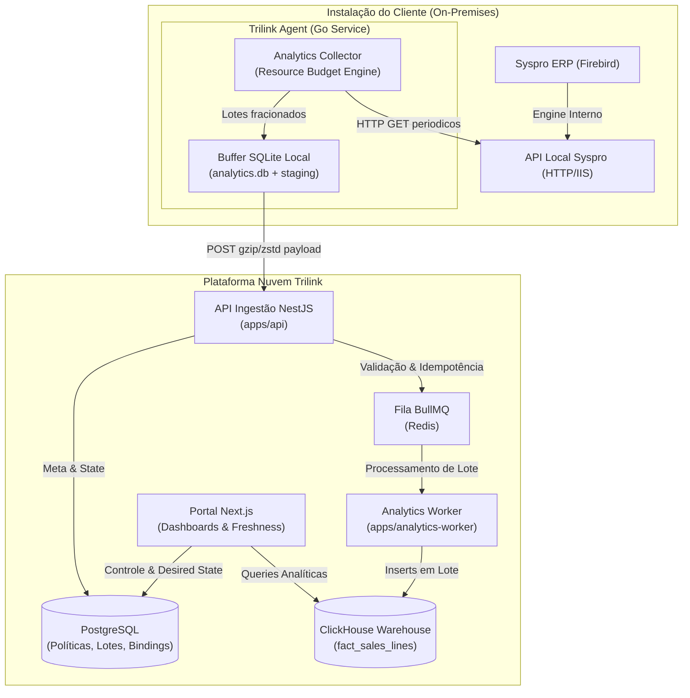

import { Cards, Card } from 'fumadocs-ui/components/card';
import { Callout } from 'fumadocs-ui/components/callout';
import { Steps, Step } from 'fumadocs-ui/components/steps';

<Callout type="info">
  O **Módulo Analytics/BI** é um novo domínio de produto no ecossistema Trilink, separado do RMM. Ele permite extrair, consolidar e visualizar dados de negócios (iniciando por Vendas) das instalações Syspro ERP sem comprometer o desempenho da infraestrutura do cliente.
</Callout>

## Separação de Domínio

O Analytics é tratado como um domínio de produto totalmente isolado do RMM no **Trilink Agent**:

```text
Trilink Agent
├── RMM
│   ├── monitoramento
│   ├── inventário
│   ├── acesso remoto
│   └── backup
│
└── Analytics
    ├── extração da API local
    ├── buffer local (SQLite)
    ├── sincronização & transporte
    ├── reconciliação
    └── diagnóstico de coleta
```

### Regras Inegociáveis de Não-Impacto

 O Analytics opera em prioridade mínima no agente e **nunca deve prejudicar**:
1. **Funcionamento do ERP Syspro** (consultas isoladas e fracionadas).
2. **Banco de Dados Firebird** (sem consultas diretas via SQL arbitrário).
3. **Atendimento ao Cliente / Operadores do ERP**.
4. **Sessão Remota (RustDesk)**.
5. **Heartbeat do Agente Trilink**.
6. **Execução de Backups**.
7. **Atualização Automática do Próprio Agente**.

---

## Princípio Fundamental: Ingestão Assíncrona Prévia

<Callout type="warn">
  **Proibido chamar a API local do ERP no momento em que o usuário abre o Dashboard.**
</Callout>

### Fluxo Incorreto (Rejeitado)
```text
Usuário abre dashboard 
  → Portal chama Agente 
  → Agente consulta ERP 
  → Usuário aguarda (lento, falha se offline)
```

### Fluxo Correto (Implementado)
```text
Agente sincroniza previamente 
  → Dados persistem no ClickHouse Warehouse 
  → Usuário abre dashboard 
  → Consulta central ultrarrápida (< 100ms)
```

**Vantagens do Fluxo Correto:**
* Evita dashboards lentos e travamentos de interface;
* Carga previsível e distribuída no ambiente do cliente;
* Disponibilidade de dados mesmo quando a máquina do cliente estiver temporariamente offline;
* Elimina concorrência de leitura com os operadores do ERP durante o horário comercial;
* Permite análise histórica de longo prazo sem onerar o banco produtivo.

---

## Arquitetura de Alto Nível



---

## Responsabilidade de Cada Camada

| Camada | Tecnologia | Responsabilidade Principal |
| :--- | :--- | :--- |
| **API Local Syspro** | HTTP / IIS (REST) | Disponibiliza endpoints JSON pré-processados pelo ERP (`dt_inicial` e `dt_final`). |
| **Trilink Agent** | Go Service | Agenda extrações, monitora CPU/RAM/Disco, grava buffer SQLite, compacta e realiza upload idempotente. |
| **API NestJS** | NestJS (`apps/api`) | Autentica agente, recebe lotes, valida contratos, assegura idempotência por SHA256 e envia à fila. |
| **Analytics Worker** | Node.js Worker | Normaliza datas/valores, resolve `company_id`, elimina duplicações e realiza ingestão no ClickHouse. |
| **Data Warehouse** | ClickHouse | Armazena bilhões de registros colunares para consultas de alta performance no portal. |
| **Portal Web** | Next.js (`apps/web`) | Renderiza dashboards executivos, exibe freshness da coleta e permite vincular empresas. |

---

## Escopo da Primeira Entrega (`Analytics → Vendas V1`)

A primeira entrega contempla exclusivamente o dataset de **Vendas**:

* **Visão Executiva**: Faturamento bruto, faturamento líquido, quantidade vendida, ticket médio, total de descontos e número de documentos.
* **Vendas por Dimensões**: Produtos, clientes, vendedores, departamentos, cidades e estados (UF), formas de pagamento e modelo de documento.

<Callout type="info">
  **Fora do escopo do MVP**: Módulos de Estoque, Financeiro (Pagar/Receber), Produção e Transporte. Serão habilitados progressivamente em versões futuras.
</Callout>

---

## Roteiro de Documentação

<Cards>
  <Card title="Coleta no Agente Go" href="/portal/docs/admin/documentacao-portal/analytics/coleta-agente" description="Resource budget, buffer SQLite, scheduler e integração com a API local." />
  <Card title="Ingestão & Worker" href="/portal/docs/admin/documentacao-portal/analytics/ingestao-worker" description="Endpoints NestJS, idempotência por hash, fila BullMQ e ClickHouse." />
  <Card title="Portal & Dashboards" href="/portal/docs/admin/documentacao-portal/analytics/portal-dashboards" description="Interface Next.js, indicadores de freshness, controle multiempresa e políticas." />
</Cards>
