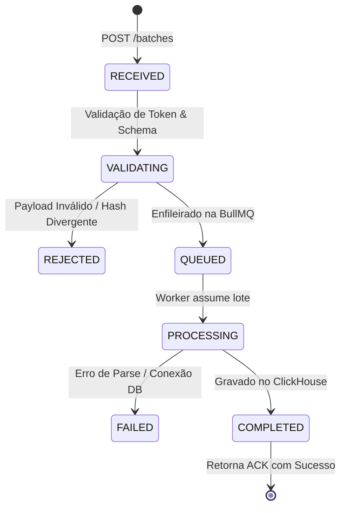

import { Callout } from 'fumadocs-ui/components/callout';
import { Steps, Step } from 'fumadocs-ui/components/steps';

<Callout type="info">
  A camada de nuvem é responsável por autenticar a conexão com o agente, assegurar a **idempotência estrita** dos lotes recebidos, processar de forma assíncrona via **BullMQ** e armazenar em alta velocidade no **ClickHouse**.
</Callout>

## Estrutura do Módulo no Backend

```text
apps/api/src/modules/analytics/
├── ingestion/                  # Endpoints HTTP de recepção de lotes e ACK
├── datasets/                   # Definições de contratos e schemas Zod
├── company-bindings/           # Mapeamento de empresas local -> portal
├── sync-policies/             # Gestão de políticas e Desired State
├── dashboards/                 # Endpoints de leitura para o Portal Next.js
├── permissions/                # Controle de acesso multiempresa
└── queries/                    # Query builders otimizados para ClickHouse

apps/analytics-worker/src/
├── consumers/                  # Consumidor de fila BullMQ (analytics-ingestion-queue)
├── validators/                 # Validação de schema Zod e integridade
├── normalizers/                # Normalização de datas, moedas e strings
├── loaders/                    # Inserção em batch no ClickHouse
├── deduplication/              # Resolução de hashes de linha e duplicatas
└── monitoring/                 # Métricas de throughput e falhas

packages/analytics-contracts/
├── sales-lines.v1.ts           # Schema Zod das linhas de vendas V1
├── batch-envelope.ts           # Payload do lote e metadados
├── ingestion-status.ts         # Contrato de ACK e estados do lote
└── sync-policy.ts              # Contrato de política enviada ao agente
```

---

## Envelope de Ingestão e Payload

O lote é enviado comprimido via HTTP com a estrutura:

```json
{
  "batchId": "c9b2e8d0-4f1a-4d3b-9a8c-7e6f5d4c3b2a",
  "dataset": "sales-lines",
  "schemaVersion": 1,
  "agentInstallationId": "agent-inst-8812",
  "sysproInstallationId": "syspro-inst-001",
  "sourceCompanyCode": "1",
  "period": {
    "from": "2026-07-21",
    "to": "2026-07-22"
  },
  "rowCount": 1450,
  "checksum": "e3b0c44298fc1c149afbf4c8996fb92427ae41e4649b934ca495991b7852b855",
  "rows": [
    {
      "empresa_codigo": "1",
      "nf_numero": "00012345",
      "nf_modelo": "55",
      "nf_dt_emissao": "2026-07-21 14:30:00",
      "produto_id": "P-992",
      "produto_descricao": "Ração Premium Cães 15kg",
      "departamento": "Pet",
      "unidade": "UN",
      "produto_qtde": 2.0,
      "produto_vlr_unitario": 120.00,
      "produto_vlr_total_item": 240.00,
      "desconto_item": 0.00,
      "vendedor": "João Silva",
      "cliente_nome": "Agropecuária Central",
      "cliente_cidade": "Curitiba",
      "cliente_uf": "PR",
      "forma_pagamento": "Boleto 30 Dias"
    }
  ]
}
```

---

## Garantia de Idempotência

<Callout type="warn">
  Reenviar o mesmo lote devido a falhas de rede **nunca** pode gerar duplicidade de dados no ClickHouse.
</Callout>

### Chave Única Imutável do Lote

```text
IdempotencyKey = SHA256(
  agentInstallationId +
  sysproInstallationId +
  dataset +
  schemaVersion +
  sourceCompanyCode +
  period.from +
  period.to +
  checksum
)
```

### Ciclo de Vida do Lote na API



Se um lote com a mesma `IdempotencyKey` for recebido novamente e estiver em estado `QUEUED`, `PROCESSING` ou `COMPLETED`, a API retorna status `200 OK` com o estado correspondente **sem re-enfileirar**.

---

## Chave Provisória de Deduplicação de Linhas (V1 vs V2)

Como a API local Syspro V1 não possui um ID único por item nem campo `updated_at`, o Analytics Worker gera uma chave hash provisória por linha (`source_row_hash`):

```text
source_row_hash = SHA256(
  source_company_code +
  nf_modelo +
  nf_numero +
  produto_id +
  nf_dt_emissao +
  produto_qtde +
  produto_vlr_total_item
)
```

No ClickHouse, a tabela `fact_sales_lines` utiliza a engine `ReplacingMergeTree(ingested_at)` ordenada por `(tenant_id, company_id, sale_date, source_row_hash)`, garantindo que registros idênticos em janelas sobrepostas sejam desduplicados automaticamente.

---

## Tabela ClickHouse (`fact_sales_lines`)

```sql
CREATE TABLE fact_sales_lines
(
    tenant_id String,
    organization_id String,
    company_id String,
    syspro_installation_id String,
    source_company_code String,
    source_row_hash String,
    
    document_number String,
    document_model String,
    sale_date Date,
    sale_datetime DateTime,
    
    customer_name String,
    customer_city String,
    customer_state LowCardinality(String),
    seller_name String,
    
    product_id String,
    product_description String,
    department LowCardinality(String),
    unit LowCardinality(String),
    
    quantity Float64,
    unit_amount Decimal(18, 4),
    discount_amount Decimal(18, 4),
    freight_amount Decimal(18, 4),
    icms_st_amount Decimal(18, 4),
    total_amount Decimal(18, 4),
    
    payment_method LowCardinality(String),
    ingested_at DateTime DEFAULT now(),
    batch_id UUID
)
ENGINE = ReplacingMergeTree(ingested_at)
PARTITION BY toYYYYMM(sale_date)
ORDER BY (tenant_id, company_id, sale_date, source_row_hash);
```

---

## Segurança e Isolamento Multiempresa (*Company Scope*)

<Callout type="important">
  **O backend nunca confia no `companyId` enviado pelo parâmetro do frontend.**
</Callout>

1. Toda consulta realizada pelo usuário no Portal passa pelo middleware de autorização do NestJS;
2. O middleware consulta no PostgreSQL as empresas que o token JWT do usuário está autorizado a visualizar;
3. O repositório de dados força a cláusula `WHERE company_id IN (...)` na consulta enviada ao ClickHouse;
4. Dados extraídos do Syspro sem mapeamento aprovado são marcados com `company_id = 'UNBOUND'` e permanecem ocultos dos dashboards até a homologação.
