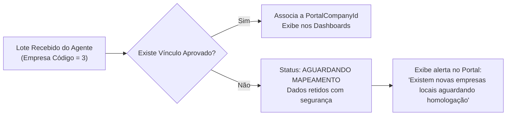

import { Callout } from 'fumadocs-ui/components/callout';
import { Cards, Card } from 'fumadocs-ui/components/card';

<Callout type="info">
  O módulo de Analytics no **Portal Next.js** oferece uma visualização executiva centralizada dos dados de vendas, permitindo ao gestor analisar indicadores em tempo de execução e auditar a saúde da coleta em tempo real.
</Callout>

## Estrutura de Navegação no Portal

```text
Analytics (Menu Principal)
├── Visão Executiva
├── Vendas
│   ├── Resumo & Filtros
│   ├── Produtos Top Performers
│   ├── Análise de Clientes
│   ├── Desempenho de Vendedores
│   └── Departamentos & Curva ABC
├── Sincronização & Freshness
└── Configurações & Vínculos de Empresa
```

---

## Dashboards de Vendas V1

### Indicadores da Visão Executiva

```text
┌─────────────────────────┬─────────────────────────┬─────────────────────────┬─────────────────────────┐
│ Faturamento Bruto       │ Faturamento Líquido     │ Ticket Médio            │ Documentos Emitidos     │
│ R$ 1.450.280,00         │ R$ 1.385.120,00         │ R$ 1.000,19             │ 1.450                   │
└─────────────────────────┴─────────────────────────┴─────────────────────────┴─────────────────────────┘
┌─────────────────────────┬─────────────────────────┬─────────────────────────┬─────────────────────────┐
│ Quantidade Vendida      │ Total de Descontos      │ Produtos Distintos      │ Clientes Atendidos      │
│ 48.920 UN               │ R$ 65.160,00 (4,5%)     │ 342                     │ 189                     │
└─────────────────────────┴─────────────────────────┴─────────────────────────┴─────────────────────────┘
```

### Dimensões e Filtros Disponíveis

* **Período Dinâmico**: Hoje, Ontem, Últimos 7 dias, Mês Atual, Mês Anterior, Período Customizado.
* **Empresa Selecionada**: Filtro por uma ou múltiplas empresas autorizadas.
* **Agrupamentos**: Por Data (Evolução diária), Produto, Departamento, Cliente, Vendedor, Cidade, Estado (UF), Forma de Pagamento e Modelo de Documento (NF-e/NFC-e).

---

## Monitor de Sincronização & Freshness UI

<Callout type="important">
  Para garantir a transparência da informação, **todo dashboard exibe visivelmente o momento e o status da última sincronização**.
</Callout>

### Componente de Status Atualizado

```text
┌─────────────────────────────────────────────────────────────────────────────────────────────────┐
│ CASA DO PRODUTOR — Filial Curitiba                                                               │
│                                                                                                 │
│  [ OK - Atualizado ]   Última sincronização: Há 6 minutos                                       │
│                        Período sincronizado: até 22/07/2026 10:15                               │
│                                                                                                 │
│  Progresso de Backfill Histórico:                                                                │
│  [██████████░░░░░░░░░░░░░░░░░░░░░░░░░░] 25% (93 dias processados / 272 restantes)                │
│                                                                                                 │
│  Última Consulta Local:                                                                         │
│  Duração: 4,8s | Registros: 1.450 | Tamanho Comprimido: 320 KB                                  │
└─────────────────────────────────────────────────────────────────────────────────────────────────┘
```

### Diagnóstico de Atraso ou Erro

Quando a coleta ultrapassa o tempo limite tolerado sem atualizações, o Portal alerta o usuário e detalha a causa raiz:

```text
┌─────────────────────────────────────────────────────────────────────────────────────────────────┐
│  [ AVISO - Dados Desatualizados ]                                                               │
│                                                                                                 │
│  Última sincronização concluída: Há 3 horas                                                     │
│  Motivo: API Local do Syspro indisponível (HTTP 500 Connection Refused)                         │
│  Próxima tentativa agendada: Em 12 minutos                                                      │
└─────────────────────────────────────────────────────────────────────────────────────────────────┘
```

---

## Gestão de Vínculos de Empresa (`AnalyticsCompanyBinding`)

Uma única instalação local do Syspro pode gerenciar múltiplos códigos de empresa (`sourceCompanyCode`). O portal necessita vincular esses códigos locais às empresas cadastradas no sistema.

### Modelo do Vínculo

```typescript
export interface AnalyticsCompanyBinding {
  id: string;
  sysproInstallationId: string;
  sourceCompanyCode: string;
  portalCompanyId: string | null;
  status: 'PENDING_MAPPING' | 'BOUND' | 'IGNORED';
  validatedAt?: string;
  validatedBy?: string;
}
```

### Tratamento de Dados Sem Vínculo



---

## Gerenciamento de Políticas via *Desired State*

O Portal permite que os administradores configurem e enviem políticas operacionais ao agente através do mecanismo de *Desired State*:

```json
{
  "analytics": {
    "enabled": true,
    "policyVersion": 1,
    "datasets": {
      "sales-lines": {
        "enabled": true,
        "intervalMinutes": 15,
        "overlapDays": 1,
        "nightlyReconciliationDays": 7,
        "weeklyReconciliationDays": 30
      }
    },
    "resourcePolicy": {
      "maxCpuPercent": 70,
      "maxMemoryPercent": 80,
      "minimumFreeMemoryMb": 1024,
      "maximumResponseMb": 50,
      "queryTimeoutSeconds": 90,
      "maximumJobDurationMinutes": 5
    },
    "maintenanceWindow": {
      "start": "00:00",
      "end": "06:00",
      "jitterMinutes": 120
    }
  }
}
```

Ao alterar qualquer parâmetro no Portal, a nova versão do Desired State é propagada e aplicada no agente na próxima sincronização de controle.
