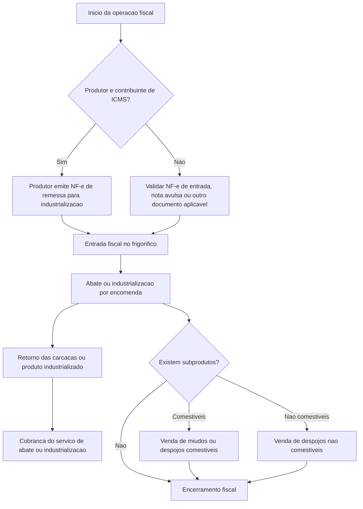

import { Callout } from "fumadocs-ui/components/callout";

## Objetivo

Esta pagina organiza a analise fiscal do processo de abate frigorifico para uso da equipe de suporte, implantacao e fiscal.

O foco aqui e responder quatro perguntas:

- qual documento fiscal deve existir em cada etapa
- qual CFOP e tratamento tributario precisam ser validados
- quais informacoes devem voltar para a parametrizacao do ERP
- quais pontos dependem de confirmacao formal com a contabilidade do cliente

<Callout title="Escopo">
  Este material nao define regra fiscal definitiva. Ele serve para estruturar a analise e evitar parametrizacao incorreta no sistema sem validacao contabil.
</Callout>

## Quando usar este material

Use esta referencia quando o atendimento envolver:

- entrada de gado para abate por encomenda
- produtor contribuinte ou nao contribuinte de ICMS
- retorno da industrializacao ao encomendante
- cobranca do servico de abate
- venda de miudos, despojos comestiveis ou nao comestiveis
- duvidas sobre ICMS, ICMS-ST, PIS e COFINS no fluxo do frigorifico

## Informacoes minimas para abrir a analise

Antes de parametrizar ou orientar emissao fiscal, levantar:

- UF do estabelecimento e UF do encomendante
- se o produtor e contribuinte de ICMS
- se o produtor emite NF-e propria, nota avulsa ou nenhum documento
- GTA vinculada a operacao
- qual produto retorna ao encomendante
- se o servico de abate sera cobrado na mesma NF-e ou em documento proprio
- quais subprodutos serao vendidos pelo frigorifico
- regime tributario da empresa
- entendimento da contabilidade sobre ICMS, ICMS-ST, PIS e COFINS

## Visao geral do fluxo fiscal



## Premissas que o suporte nao deve assumir sozinho

- CFOP definitivo sem validacao contabil
- incidencia ou nao de ICMS no servico de abate
- uso de ICMS-ST para miudos sem confirmar NCM e regra estadual
- PIS e COFINS sem avaliar regime tributario da empresa
- diferimento sem fundamento legal aplicavel a UF e ao produto

## Etapa 1: entrada do gado em pe para abate

### Natureza da operacao

Remessa de gado em pe para industrializacao por encomenda, vinculada a GTA e ao documento fiscal correspondente.

### O que o suporte deve validar

- quem e o emitente do documento de entrada
- qual CFOP representa corretamente a remessa
- se existe suspensao, diferimento, isencao ou nao destaque de ICMS
- como a GTA sera referenciada no documento

## Cenario A: produtor contribuinte de ICMS

Quando o produtor rural ou encomendante for contribuinte e possuir obrigacao de emissao, a remessa deve ser formalizada por NF-e emitida pelo proprio produtor.

### Documento fiscal esperado

| Campo | Tratamento |
|---|---|
| Documento | NF-e de remessa para industrializacao |
| Emitente | Produtor ou encomendante |
| Destinatario | Frigorifico |
| CFOP | 5.122, sujeito a validacao fiscal |
| Documento auxiliar | GTA |
| Finalidade | Remessa de gado para abate ou industrializacao |

### Tratamento fiscal a validar

| Tributo | Tratamento |
|---|---|
| ICMS | Validar suspensao, diferimento ou nao destaque |
| ICMS-ST | Nao se aplica na remessa do gado |
| PIS | Normalmente nao representa receita do frigorifico |
| COFINS | Normalmente nao representa receita do frigorifico |
| NF referenciada | Deve ser referenciada na nota de retorno |
| Informacao complementar | Recomendada, citando remessa para industrializacao e GTA |

### Texto sugerido para informacoes complementares

```txt
Mercadoria remetida para industrializacao por encomenda, vinculada a GTA no [GTA].
Operacao de remessa para abate ou industrializacao, com posterior retorno dos produtos industrializados.
```

## Cenario B: produtor nao contribuinte de ICMS

Quando o produtor nao for contribuinte ou nao possuir capacidade de emissao, deve-se validar com a contabilidade qual documento acobertara a entrada do gado no frigorifico.

### Possibilidades usuais

| Situacao | Tratamento possivel |
|---|---|
| Produtor nao emite NF-e | Frigorifico pode precisar emitir NF-e de entrada |
| Produtor possui nota avulsa | Utilizar o documento fiscal emitido pelo orgao competente |
| Operacao acompanhada apenas de GTA | Validar se a GTA e suficiente ou se exige NF-e de entrada |
| Operacao interna em MG | Validar regra especifica do RICMS/MG e orientacao contabil |

### Documento fiscal a validar

| Campo | Tratamento |
|---|---|
| Documento | NF-e de entrada, nota avulsa ou outro documento aplicavel |
| Emitente | Frigorifico, produtor ou orgao competente, conforme o caso |
| Destinatario | Frigorifico |
| CFOP | Definir conforme natureza da entrada |
| Documento auxiliar | GTA |
| Finalidade | Entrada de gado para abate ou industrializacao |

### Tratamento fiscal a validar

| Tributo | Tratamento |
|---|---|
| ICMS | Validar diferimento, suspensao, isencao ou nao destaque |
| ICMS-ST | Nao se aplica na entrada do gado para abate |
| PIS | Normalmente nao representa aquisicao para revenda direta |
| COFINS | Normalmente nao representa aquisicao para revenda direta |
| NF referenciada | O documento de entrada deve ser referenciado no retorno, se aplicavel |
| Informacao complementar | Deve citar GTA, produtor e finalidade da entrada |

### Texto sugerido para informacoes complementares

```txt
Entrada de gado em pe para industrializacao ou abate por encomenda, referente ao produtor [NOME/CPF],
acompanhada da GTA no [GTA]. Documento emitido para acobertar a entrada fiscal da operacao,
conforme orientacao contabil aplicavel.
```

## Etapa 2: retorno das carcacas ou produto industrializado

Apos o abate, deve ser emitida nota de retorno das mercadorias industrializadas ao encomendante.

### Documento fiscal esperado

| Campo | Tratamento |
|---|---|
| Documento | NF-e de retorno de industrializacao |
| Emitente | Frigorifico |
| Destinatario | Encomendante ou produtor |
| CFOP interno | 5.925 |
| CFOP interestadual | 6.925 |
| Produto | Carcacas, bandas ou produto industrializado retornado |
| NF referenciada | NF-e de remessa ou documento fiscal de entrada |

### Tratamento fiscal sugerido

| Tributo | Tratamento |
|---|---|
| ICMS | Normalmente sem destaque sobre o retorno |
| ICMS-ST | Nao se aplica ao retorno |
| PIS | Normalmente nao gera debito como venda |
| COFINS | Normalmente nao gera debito como venda |
| Informacao complementar | Deve citar NF de origem, GTA e retorno da industrializacao |

### Ponto critico

O retorno da carcaca ou produto industrializado nao deve ser tratado como venda.

### Texto sugerido para informacoes complementares

```txt
Retorno de mercadoria recebida para industrializacao por encomenda, referente a NF-e de origem no [NF_ORIGEM],
serie [SERIE], emitida em [DATA], vinculada a GTA no [GTA].
Operacao de retorno dos produtos resultantes do abate ou industrializacao.
```

## Etapa 3: cobranca do servico de abate ou industrializacao

Na mesma nota de retorno ou em documento proprio, deve ser incluida a cobranca do servico, conforme orientacao fiscal.

### Documento fiscal esperado

| Campo | Tratamento |
|---|---|
| Documento | NF-e com item de servico ou industrializacao |
| Emitente | Frigorifico |
| Destinatario | Encomendante |
| CFOP interno | 5.125 |
| CFOP interestadual | 6.125 |
| Descricao | Mao de obra e materiais aplicados no processo |
| NF referenciada | NF-e de remessa ou de entrada |

### Tratamento fiscal a validar

| Tributo | Tratamento |
|---|---|
| ICMS | Validar se ha destaque no servico |
| ICMS-ST | Nao se aplica ao servico |
| PIS | Definir conforme regime tributario |
| COFINS | Definir conforme regime tributario |
| Base de calculo | Valor cobrado pelo servico |
| Informacao complementar | Vincular o servico a operacao de industrializacao |

### Texto sugerido para informacoes complementares

```txt
Cobranca referente aos servicos de abate ou industrializacao prestados sobre mercadoria recebida para industrializacao,
vinculada a NF-e de origem no [NF_ORIGEM], serie [SERIE], e a GTA no [GTA].
```

## Etapa 4: venda de despojos nao comestiveis

Os produtos nao comestiveis resultantes do abate podem ter tratamento especifico, inclusive diferimento de ICMS.

### Produtos exemplificativos

| Produto | NCM sugerida |
|---|---|
| Despojos nao comestiveis | 0511.99.99 |
| Sebo | Validar NCM |
| Osso | Validar NCM |
| Couro | Validar NCM |
| Sangue ou residuos | Validar NCM |

### Documento fiscal esperado

| Campo | Tratamento |
|---|---|
| Documento | NF-e de venda |
| Emitente | Frigorifico |
| Destinatario | Comprador |
| CFOP interno | 5.101 |
| CFOP interestadual | 6.101 |
| Natureza | Venda de producao do estabelecimento |

### Tratamento fiscal a validar

| Tributo | Tratamento |
|---|---|
| ICMS | Diferimento, se aplicavel |
| ICMS-ST | Normalmente nao se aplica, salvo regra especifica |
| PIS | Definir conforme regime, produto e NCM |
| COFINS | Definir conforme regime, produto e NCM |
| Informacao complementar | Citar diferimento e fundamento legal, quando aplicavel |

## Etapa 5: venda de despojos comestiveis ou miudos

A venda de miudos e despojos comestiveis deve ser tratada conforme NCM, enquadramento fiscal e eventual substituicao tributaria.

### Produtos exemplificativos

| Produto | NCM |
|---|---|
| Figado bovino | 0206.22.00 |
| Coracao bovino | 0206.29.90 |
| Lingua bovina | 0206.21.00 |
| Bucho bovino | 0206.29.90 |
| Mocoto bovino | 0206.29.90 |

### Documento fiscal base

| Campo | Tratamento |
|---|---|
| Documento | NF-e de venda |
| Emitente | Frigorifico |
| Destinatario | Comprador |
| CFOP | 5.405, quando mercadoria sujeita a ST ja recolhida |
| CST ICMS | 060, quando ICMS-ST ja foi recolhido anteriormente |

### Cenario A: ICMS-ST ja recolhido anteriormente

| Campo | Tratamento |
|---|---|
| CFOP | 5.405 |
| CST ICMS | 060 |
| ICMS proprio | Sem destaque |
| ICMS-ST | Sem novo destaque |
| Informacao complementar | Informar mercadoria sujeita a ST, se necessario |

### Cenario B: frigorifico responsavel pela apuracao da ST

| Campo | Tratamento |
|---|---|
| CFOP | Validar conforme responsabilidade tributaria |
| CST ICMS | Validar se deve ser de substituto ou substituido |
| ICMS-ST | Pode exigir calculo ou apuracao por periodo |
| Recolhimento | Guia unica ou forma definida pela legislacao |
| Informacao complementar | Citar a sistematica de apuracao, se necessario |

## PIS e COFINS

O tratamento de PIS e COFINS deve ser definido por operacao, produto, NCM e regime tributario.

| Operacao | Tratamento sugerido |
|---|---|
| Entrada do gado | Normalmente nao representa receita |
| Retorno da industrializacao | Normalmente nao representa venda |
| Servico de abate | Pode gerar receita tributavel |
| Venda de despojos nao comestiveis | Validar CST, aliquota e natureza da receita |
| Venda de miudos comestiveis | Validar CST, aliquota e natureza da receita |

## Matriz fiscal consolidada

| Etapa | Documento | CFOP | ICMS | ICMS-ST | PIS/COFINS | Observacao |
|---|---|---|---|---|---|---|
| Entrada produtor contribuinte | NF-e de remessa | 5.122 | Validar suspensao, diferimento ou nao destaque | Nao se aplica | Normalmente nao receita | Citar GTA e industrializacao |
| Entrada produtor nao contribuinte | NF-e de entrada, nota avulsa ou outro | Validar | Validar regra aplicavel | Nao se aplica | Validar | Citar GTA e produtor |
| Retorno da carcaca | NF-e de retorno | 5.925 / 6.925 | Normalmente sem destaque | Nao se aplica | Normalmente nao venda | Referenciar NF de origem e GTA |
| Servico de abate | NF-e com item de servico | 5.125 / 6.125 | Validar destaque | Nao se aplica | Validar conforme regime | Vincular a industrializacao |
| Venda de despojo nao comestivel | NF-e de venda | 5.101 / 6.101 | Diferimento, se aplicavel | Normalmente nao | Validar | Citar fundamento legal |
| Venda de miudo comestivel | NF-e de venda | 5.405, se ST anterior | Sem destaque se CST 060 | Ja recolhido ou apurado | Validar | Citar ST, se necessario |

## O que pode virar parametrizacao no ERP

Depois da validacao contabil, o suporte pode estruturar no sistema:

- CFOP por etapa da operacao
- CST ICMS, PIS e COFINS por tipo de documento ou produto
- textos padrao de informacoes complementares
- exigencia de NF referenciada no retorno
- campos para GTA, produtor e fundamento legal
- segregacao entre retorno da industrializacao e cobranca do servico
- regras distintas para despojos comestiveis e nao comestiveis

## O que nao deve virar regra fixa sem validacao

- uso automatico de 5.122, 5.125, 5.405, 5.925, 6.101 ou 6.925 sem confirmar o cenario
- tratamento unico para produtor contribuinte e nao contribuinte
- aplicacao padrao de ICMS-ST para todos os miudos
- diferimento padrao para todos os despojos nao comestiveis
- tributacao de PIS e COFINS sem avaliar regime e natureza da receita

## Checklist para validacao com a contabilidade

### Entrada do gado

- [ ] Produtor e contribuinte de ICMS?
- [ ] Produtor emite NF-e?
- [ ] Sera utilizada nota avulsa?
- [ ] O frigorifico precisa emitir NF-e de entrada?
- [ ] Qual CFOP deve ser utilizado?
- [ ] Ha suspensao, diferimento ou nao destaque de ICMS?
- [ ] A GTA sera informada nas informacoes complementares?
- [ ] A NF-e de entrada ou remessa sera referenciada no retorno?

### Retorno da industrializacao

- [ ] CFOP 5.925 ou 6.925 confirmado?
- [ ] ICMS sem destaque confirmado?
- [ ] PIS e COFINS sem debito confirmado?
- [ ] NF-e de origem sera referenciada?
- [ ] GTA sera citada?
- [ ] Texto complementar validado?

### Servico de abate

- [ ] CFOP 5.125 ou 6.125 confirmado?
- [ ] ICMS incide sobre o servico?
- [ ] Qual CST ICMS utilizar?
- [ ] Qual CST PIS utilizar?
- [ ] Qual CST COFINS utilizar?
- [ ] Havera materiais aplicados?
- [ ] Materiais aplicados terao tributacao separada?

### Despojos nao comestiveis

- [ ] NCM confirmada?
- [ ] CFOP 5.101 ou 6.101 confirmado?
- [ ] Ha diferimento de ICMS?
- [ ] Qual fundamento legal?
- [ ] PIS e COFINS definidos?
- [ ] Texto complementar validado?

### Miudos ou despojos comestiveis

- [ ] NCM de cada produto confirmada?
- [ ] Produto esta sujeito a ICMS-ST?
- [ ] O frigorifico e substituto ou substituido?
- [ ] Deve usar CST 060?
- [ ] Deve usar CFOP 5.405?
- [ ] Ha destaque de ICMS-ST?
- [ ] ST sera apurada por periodo?
- [ ] PIS e COFINS definidos?

## Conclusao

No suporte, o processo fiscal do frigorifico deve ser tratado como uma matriz por operacao, nunca como uma unica regra automatica.

O caminho seguro e:

1. identificar corretamente o cenario fiscal
2. validar o tratamento com a contabilidade
3. so depois transformar a decisao em parametrizacao do ERP

Isso reduz retrabalho, evita emissao indevida e deixa claro o que e regra de sistema e o que e decisao tributaria do cliente.
