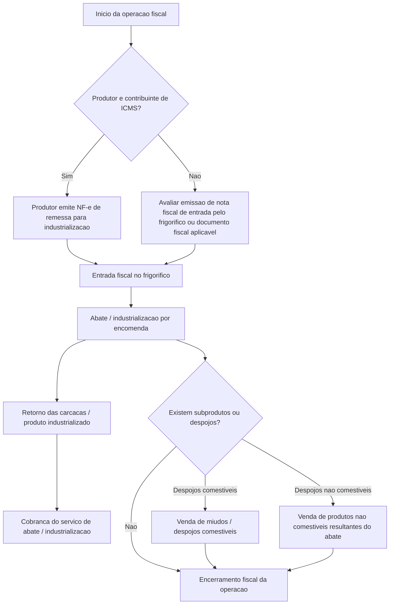

import { Callout } from 'fumadocs-ui/components/callout';
import { Card, Cards } from 'fumadocs-ui/components/card';
import { Accordion, Accordions } from 'fumadocs-ui/components/accordion';
import { Tabs, Tab } from 'fumadocs-ui/components/tabs';
import { InlineTOC } from 'fumadocs-ui/components/inline-toc';

# Analise Fiscal do Processo de Abate Frigorifico

Este documento organiza a analise fiscal da operacao de abate frigorifico com foco exclusivo no tratamento tributario. O objetivo aqui nao e descrever fluxo operacional do sistema, e sim consolidar os cenarios fiscais que precisam orientar parametrizacao, emissao documental e validacao contabil.

<Callout type="info" title="Escopo do documento">
  Este material trata exclusivamente dos aspectos fiscais da operacao. Nao cobre telas, modulos, estoque, pesagem, rendimento ou comportamento operacional do sistema.
</Callout>

<Cards>
  <Card title="Quando usar">
    Utilize este documento quando houver necessidade de validar entrada do gado, retorno de industrializacao, cobranca do servico de abate e venda de subprodutos.
  </Card>

  <Card title="O que validar antes">
    Confirme com a contabilidade o enquadramento do produtor, o documento fiscal de entrada, o tratamento de ICMS/ICMS-ST e a incidencia de PIS/COFINS por operacao.
  </Card>
</Cards>

<InlineTOC />

---

## 1. Objetivo do Documento

Este documento tem como objetivo estruturar a analise fiscal do processo de abate frigorifico, considerando exclusivamente os aspectos fiscais da operacao.

A analise contempla:

- entrada do gado para abate;
- produtor contribuinte e nao contribuinte;
- emissao ou recebimento de documentos fiscais;
- retorno da industrializacao;
- cobranca do servico de abate;
- venda de despojos comestiveis;
- venda de despojos nao comestiveis;
- ICMS;
- ICMS-ST;
- PIS;
- COFINS;
- notas fiscais referenciadas;
- informacoes complementares.

---

## 2. Visao Geral do Processo Fiscal



<Callout type="warning" title="Premissa de suporte">
  O fluxo abaixo serve para orientar analise fiscal e parametrizacao. Nenhuma etapa deve ser automatizada como regra fixa sem confirmacao do enquadramento contabil e da legislacao aplicavel.
</Callout>

---

## 3. Entrada do Gado em Pe para Abate

### 3.1 Natureza da Operacao

Remessa de gado em pe para industrializacao por encomenda.

A operacao deve estar vinculada a GTA e ao documento fiscal correspondente.

---

## 4. Cenarios de Entrada

<Tabs items={['Produtor contribuinte', 'Produtor nao contribuinte']}>
  <Tab value="Produtor contribuinte">

### 4.1 Cenario A - Produtor Contribuinte de ICMS

Quando o produtor rural ou encomendante for contribuinte de ICMS e possuir obrigacao de emissao de documento fiscal, a remessa do gado ao frigorifico deve ser formalizada por NF-e emitida pelo proprio produtor/encomendante.

#### Documento Fiscal

| Campo | Tratamento |
|---|---|
| Documento | NF-e de remessa para industrializacao |
| Emitente | Produtor / encomendante |
| Destinatario | Frigorifico |
| CFOP | 5.122, conforme validacao fiscal |
| Documento auxiliar | GTA |
| Finalidade | Remessa de gado para industrializacao / abate |

#### Tratamento Fiscal

| Tributo | Tratamento a validar |
|---|---|
| ICMS | Validar suspensao, diferimento ou nao destaque conforme legislacao aplicavel |
| ICMS-ST | Nao se aplica na remessa do gado |
| PIS | Normalmente nao representa receita de venda para o frigorifico |
| COFINS | Normalmente nao representa receita de venda para o frigorifico |
| NF referenciada | A NF-e de remessa devera ser referenciada na nota de retorno |
| Informacao complementar | Recomendada, citando remessa para industrializacao e GTA |

#### Informacao Complementar Sugerida

```txt
Mercadoria remetida para industrializacao por encomenda, vinculada a GTA no [GTA].
Operacao de remessa para abate/industrializacao, com posterior retorno dos produtos industrializados.
```

  </Tab>

  <Tab value="Produtor nao contribuinte">

### 4.2 Cenario B - Produtor Nao Contribuinte de ICMS

Quando o produtor/encomendante nao for contribuinte de ICMS ou nao possuir obrigacao/capacidade de emissao de NF-e, deve-se validar com a contabilidade qual documento fiscal sera utilizado para acobertar a entrada do gado no frigorifico.

#### Possiveis Tratamentos

| Situacao | Tratamento fiscal possivel |
|---|---|
| Produtor nao emite NF-e | Frigorifico pode precisar emitir NF-e de entrada, conforme orientacao fiscal |
| Produtor possui nota avulsa | Utilizar documento fiscal emitido pela autoridade/orgao competente |
| Operacao acompanhada apenas de GTA | Validar se a GTA e suficiente ou se exige NF-e de entrada |
| Operacao interna em MG | Validar regra especifica do RICMS/MG e orientacao contabil |

#### Documento Fiscal

| Campo | Tratamento a validar |
|---|---|
| Documento | NF-e de entrada, nota avulsa ou outro documento fiscal aplicavel |
| Emitente | Frigorifico, produtor ou orgao competente, conforme o caso |
| Destinatario | Frigorifico |
| CFOP | Definir conforme natureza da entrada |
| Documento auxiliar | GTA |
| Finalidade | Entrada de gado para industrializacao / abate |

#### Tratamento Fiscal

| Tributo | Tratamento a validar |
|---|---|
| ICMS | Validar se existe diferimento, suspensao, isencao ou nao destaque |
| ICMS-ST | Nao se aplica na entrada do gado para abate |
| PIS | Normalmente nao representa aquisicao para revenda direta, mas deve ser validado |
| COFINS | Normalmente nao representa aquisicao para revenda direta, mas deve ser validado |
| NF referenciada | O documento de entrada devera ser referenciado no retorno, se aplicavel |
| Informacao complementar | Deve citar GTA, produtor e finalidade da entrada |

#### Informacao Complementar Sugerida

```txt
Entrada de gado em pe para industrializacao/abate por encomenda, referente ao produtor [NOME/CPF],
acompanhada da GTA no [GTA]. Documento emitido para acobertar a entrada fiscal da operacao,
conforme orientacao fiscal aplicavel.
```

  </Tab>
</Tabs>

---

## 5. Retorno das Carcacas / Produto Industrializado

Apos o abate, deve ser emitida nota fiscal de retorno das mercadorias industrializadas ao encomendante.

| Campo | Tratamento |
|---|---|
| Documento | NF-e de retorno de industrializacao |
| Emitente | Frigorifico |
| Destinatario | Encomendante / produtor |
| CFOP interno | 5.925 |
| CFOP interestadual | 6.925 |
| Produto | Carcacas, bandas ou produto industrializado retornado |
| NF referenciada | NF-e de remessa ou documento fiscal de entrada |

| Tributo | Tratamento sugerido |
|---|---|
| ICMS | Normalmente sem destaque sobre o retorno |
| ICMS-ST | Nao se aplica ao retorno da mercadoria industrializada |
| PIS | Normalmente nao gera debito como venda |
| COFINS | Normalmente nao gera debito como venda |
| Informacao complementar | Deve citar NF de origem, GTA e retorno da industrializacao |

<Callout type="warning" title="Observacao fiscal">
  O retorno da carcaca ou produto industrializado nao deve ser tratado como venda. Trata-se do retorno da mercadoria recebida anteriormente para industrializacao por encomenda.
</Callout>

### Informacao Complementar Sugerida

```txt
Retorno de mercadoria recebida para industrializacao por encomenda, referente a NF-e no [NF_ORIGEM],
serie [SERIE], emitida em [DATA], vinculada a GTA no [GTA].
Operacao de retorno dos produtos resultantes do abate/industrializacao.
```

---

## 6. Cobranca do Servico de Abate / Industrializacao

Na mesma nota de retorno ou em documento fiscal proprio, deve ser incluida a cobranca do servico de abate/industrializacao, conforme orientacao fiscal.

| Campo | Tratamento |
|---|---|
| Documento | NF-e com item de servico/industrializacao |
| Emitente | Frigorifico |
| Destinatario | Encomendante |
| CFOP interno | 5.125 |
| CFOP interestadual | 6.125 |
| Descricao | Servico de mao de obra e materiais aplicados no processo de industrializacao |
| NF referenciada | NF-e de remessa ou entrada |

| Tributo | Tratamento a validar |
|---|---|
| ICMS | Validar se ha destaque no servico de industrializacao |
| ICMS-ST | Nao se aplica ao servico |
| PIS | Deve ser definido conforme regime tributario da empresa |
| COFINS | Deve ser definido conforme regime tributario da empresa |
| Base de calculo | Valor cobrado pelo servico |
| Informacao complementar | Deve vincular o servico a operacao de industrializacao |

### Informacao Complementar Sugerida

```txt
Cobranca referente aos servicos de abate/industrializacao prestados sobre mercadoria recebida para industrializacao,
vinculada a NF-e de origem no [NF_ORIGEM], serie [SERIE], e a GTA no [GTA].
```

---

## 7. Venda de Subprodutos e Despojos

<Tabs items={['Nao comestiveis', 'Comestiveis / miudos']}>
  <Tab value="Nao comestiveis">

### 7.1 Venda de Despojos Nao Comestiveis

Os produtos nao comestiveis resultantes do abate podem ter tratamento fiscal especifico, inclusive diferimento do ICMS, conforme legislacao aplicavel.

#### Produtos Exemplificativos

| Produto | NCM sugerida |
|---|---|
| Despojos nao comestiveis | 0511.99.99 |
| Sebo | Validar NCM |
| Osso | Validar NCM |
| Couro | Validar NCM |
| Sangue / residuos | Validar NCM |

#### Documento Fiscal

| Campo | Tratamento |
|---|---|
| Documento | NF-e de venda |
| Emitente | Frigorifico |
| Destinatario | Comprador |
| CFOP interno | 5.101 |
| CFOP interestadual | 6.101 |
| Natureza | Venda de producao do estabelecimento |

#### Tratamento Fiscal

| Tributo | Tratamento a validar |
|---|---|
| ICMS | Diferimento, se aplicavel |
| ICMS-ST | Normalmente nao se aplica, salvo regra especifica |
| PIS | Definir conforme regime, produto e NCM |
| COFINS | Definir conforme regime, produto e NCM |
| Informacao complementar | Citar diferimento e fundamento legal, quando aplicavel |

#### Informacao Complementar Sugerida

```txt
Operacao com produto nao comestivel resultante do abate de gado, com tratamento fiscal conforme legislacao aplicavel.
ICMS diferido, quando atendidas as condicoes legais. Produto oriundo de processo de abate/industrializacao.
```

  </Tab>

  <Tab value="Comestiveis / miudos">

### 7.2 Venda de Despojos Comestiveis / Miudos

A venda de miudos e despojos comestiveis deve ser tratada conforme NCM, enquadramento fiscal e eventual regime de substituicao tributaria.

#### Produtos Exemplificativos

| Produto | NCM |
|---|---|
| Figado bovino | 0206.22.00 |
| Coracao bovino | 0206.29.90 |
| Lingua bovina | 0206.21.00 |
| Bucho bovino | 0206.29.90 |
| Mocoto bovino | 0206.29.90 |

#### Documento Fiscal

| Campo | Tratamento |
|---|---|
| Documento | NF-e de venda |
| Emitente | Frigorifico |
| Destinatario | Comprador |
| CFOP | 5.405, quando mercadoria sujeita a ST ja recolhida |
| CST ICMS | 060, quando ICMS-ST ja foi recolhido anteriormente |

#### Cenario A - ICMS-ST Ja Recolhido Anteriormente

| Campo | Tratamento |
|---|---|
| CFOP | 5.405 |
| CST ICMS | 060 |
| ICMS proprio | Sem destaque |
| ICMS-ST | Sem novo destaque |
| Informacao complementar | Informar mercadoria sujeita a ST, se necessario |

#### Cenario B - Frigorifico Responsavel pela Apuracao da ST

| Campo | Tratamento a validar |
|---|---|
| CFOP | Validar conforme responsabilidade tributaria |
| CST ICMS | Validar se deve ser CST de substituto ou substituido |
| ICMS-ST | Pode exigir calculo ou apuracao por periodo |
| Recolhimento | Guia unica ou forma definida pela legislacao |
| Informacao complementar | Citar sistematica de apuracao, se necessario |

#### Informacao Complementar Sugerida

```txt
Mercadoria sujeita ao regime de substituicao tributaria do ICMS, conforme legislacao aplicavel.
CST [CST]. Produto oriundo de processo de abate/industrializacao.
```

  </Tab>
</Tabs>

---

## 8. PIS e COFINS

O tratamento de PIS e COFINS deve ser definido por operacao, produto, NCM e regime tributario da empresa.

### 8.1 Matriz de PIS/COFINS

| Operacao | Tratamento sugerido |
|---|---|
| Entrada do gado | Normalmente nao representa receita |
| Retorno da industrializacao | Normalmente nao representa venda |
| Servico de abate | Pode gerar receita tributavel |
| Venda de despojos nao comestiveis | Validar CST, aliquota e natureza da receita |
| Venda de miudos comestiveis | Validar CST, aliquota e natureza da receita |

### 8.2 Campos Necessarios

| Campo | Observacao |
|---|---|
| CST PIS | Definir por operacao/produto |
| Base PIS | Definir quando houver incidencia |
| Aliquota PIS | Conforme regime |
| Valor PIS | Calculado quando aplicavel |
| CST COFINS | Definir por operacao/produto |
| Base COFINS | Definir quando houver incidencia |
| Aliquota COFINS | Conforme regime |
| Valor COFINS | Calculado quando aplicavel |
| Natureza da receita | Obrigatoria em alguns cenarios |

---

## 9. Matriz Fiscal Consolidada

| Etapa | Documento | CFOP | ICMS | ICMS-ST | PIS/COFINS | Informacao complementar |
|---|---|---|---|---|---|---|
| Entrada produtor contribuinte | NF-e de remessa | 5.122 | Validar suspensao/diferimento/nao destaque | Nao se aplica | Normalmente nao receita | Citar GTA e industrializacao |
| Entrada produtor nao contribuinte | NF-e entrada / nota avulsa / outro | Validar | Validar regra aplicavel | Nao se aplica | Validar | Citar GTA e produtor |
| Retorno da carcaca | NF-e de retorno | 5.925 / 6.925 | Normalmente sem destaque | Nao se aplica | Normalmente nao venda | Referenciar NF origem e GTA |
| Servico de abate | NF-e com item de servico | 5.125 / 6.125 | Validar destaque | Nao se aplica | Validar conforme regime | Vincular a industrializacao |
| Venda despojo nao comestivel | NF-e venda | 5.101 / 6.101 | Diferimento, se aplicavel | Normalmente nao | Validar | Citar fundamento legal |
| Venda miudo comestivel | NF-e venda | 5.405, se ST anterior | Sem destaque se CST 060 | Ja recolhido ou apurado | Validar | Citar ST, se necessario |

---

## 10. Pontos Criticos da Analise Fiscal

<Accordions type="single">
  <Accordion title="1. Retorno da carcaca nao e venda" id="retorno-nao-venda">
    Nao tratar o retorno da carcaca como venda.
  </Accordion>

  <Accordion title="2. Separar retorno da cobranca do servico" id="separar-retorno-servico">
    Separar retorno da industrializacao da cobranca do servico.
  </Accordion>

  <Accordion title="3. Validar emissao do produtor contribuinte" id="produtor-contribuinte">
    Validar se produtor contribuinte emite NF-e propria.
  </Accordion>

  <Accordion title="4. Validar entrada do produtor nao contribuinte" id="produtor-nao-contribuinte">
    Validar tratamento quando produtor nao contribuinte nao emite NF-e.
  </Accordion>

  <Accordion title="5. Confirmar a tributacao do servico de abate" id="tributacao-servico">
    Confirmar se o servico de abate sofre ICMS, ISS ou outro tratamento conforme entendimento fiscal.
  </Accordion>

  <Accordion title="6. Confirmar incidencia de ICMS-ST nos miudos" id="miudos-st">
    Confirmar se os miudos estao sujeitos a ICMS-ST.
  </Accordion>

  <Accordion title="7. Diferenciar ST ja recolhida de ST a apurar" id="st-diferenciar">
    Diferenciar mercadoria com ST ja recolhida de mercadoria cuja ST sera apurada pelo frigorifico.
  </Accordion>

  <Accordion title="8. Confirmar PIS/COFINS por operacao" id="pis-cofins-operacao">
    Confirmar PIS/COFINS por operacao, NCM e regime tributario.
  </Accordion>

  <Accordion title="9. Guardar fundamento legal parametrizavel" id="fundamento-legal">
    Guardar fundamento legal parametrizavel.
  </Accordion>

  <Accordion title="10. Automatizar somente o que for auditavel" id="automacao-auditavel">
    Utilizar informacoes complementares automaticas e auditaveis.
  </Accordion>
</Accordions>

---

## 11. Conclusao

O processo fiscal do frigorifico deve ser tratado como uma matriz fiscal por operacao.

A estrutura recomendada separa:

- entrada do gado;
- retorno da industrializacao;
- servico de abate;
- venda de despojos nao comestiveis;
- venda de miudos/despojos comestiveis.

Para cada etapa, devem ser definidos:

- documento fiscal;
- CFOP;
- CST ICMS;
- ICMS;
- ICMS-ST;
- CST PIS;
- CST COFINS;
- NF-e referenciada;
- GTA;
- fundamento legal;
- informacoes complementares.

<Callout type="success" title="Resumo executivo">
  Essa abordagem evita que o sistema aplique regra fiscal fixa em uma operacao que depende de enquadramento, produto, destinatario, regime tributario e legislacao estadual.
</Callout>
