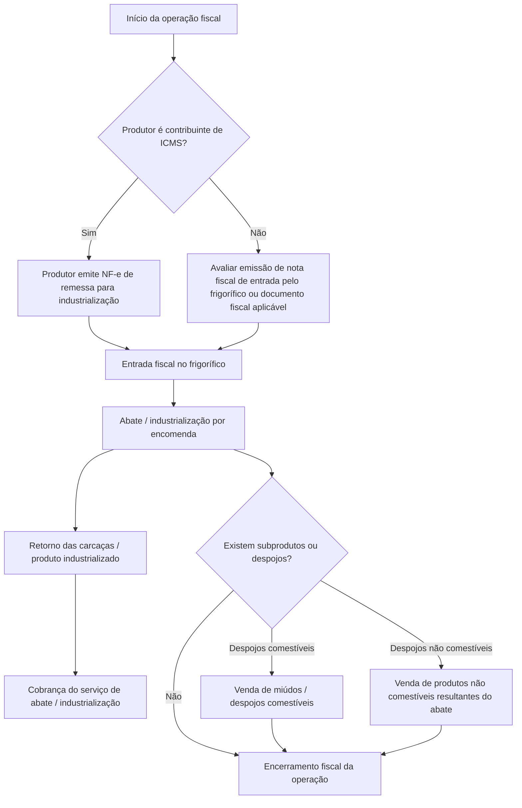

# Análise Fiscal do Processo de Abate Frigorífico

## 1. Objetivo do Documento

Este documento tem como objetivo estruturar a análise fiscal do processo de abate frigorífico, considerando exclusivamente os aspectos fiscais da operação.

A análise contempla:

- entrada do gado para abate;
- produtor contribuinte e não contribuinte;
- emissão ou recebimento de documentos fiscais;
- retorno da industrialização;
- cobrança do serviço de abate;
- venda de despojos comestíveis;
- venda de despojos não comestíveis;
- ICMS;
- ICMS-ST;
- PIS;
- COFINS;
- notas fiscais referenciadas;
- informações complementares.

> Este documento não trata de telas, módulos, estoque, pesagem, rendimento ou funcionalidades operacionais do sistema. O foco é exclusivamente fiscal.

---

## 2. Visão Geral do Processo Fiscal



---

## 3. Entrada do Gado em Pé para Abate

### 3.1 Natureza da Operação

Remessa de gado em pé para industrialização por encomenda.

A operação deve estar vinculada à GTA e ao documento fiscal correspondente.

---

## 4. Cenário A — Produtor Contribuinte de ICMS

Quando o produtor rural ou encomendante for contribuinte de ICMS e possuir obrigação de emissão de documento fiscal, a remessa do gado ao frigorífico deve ser formalizada por NF-e emitida pelo próprio produtor/encomendante.

### 4.1 Documento Fiscal

| Campo | Tratamento |
|---|---|
| Documento | NF-e de remessa para industrialização |
| Emitente | Produtor / encomendante |
| Destinatário | Frigorífico |
| CFOP | 5.122, conforme validação fiscal |
| Documento auxiliar | GTA |
| Finalidade | Remessa de gado para industrialização / abate |

### 4.2 Tratamento Fiscal

| Tributo | Tratamento a validar |
|---|---|
| ICMS | Validar suspensão, diferimento ou não destaque conforme legislação aplicável |
| ICMS-ST | Não se aplica na remessa do gado |
| PIS | Normalmente não representa receita de venda para o frigorífico |
| COFINS | Normalmente não representa receita de venda para o frigorífico |
| NF referenciada | A NF-e de remessa deverá ser referenciada na nota de retorno |
| Informação complementar | Recomendada, citando remessa para industrialização e GTA |

### 4.3 Informação Complementar Sugerida

```txt
Mercadoria remetida para industrialização por encomenda, vinculada à GTA nº [GTA].
Operação de remessa para abate/industrialização, com posterior retorno dos produtos industrializados.
```

---

## 5. Cenário B — Produtor Não Contribuinte de ICMS

Quando o produtor/encomendante não for contribuinte de ICMS ou não possuir obrigação/capacidade de emissão de NF-e, deve-se validar com a contabilidade qual documento fiscal será utilizado para acobertar a entrada do gado no frigorífico.

### 5.1 Possíveis Tratamentos

| Situação | Tratamento fiscal possível |
|---|---|
| Produtor não emite NF-e | Frigorífico pode precisar emitir NF-e de entrada, conforme orientação fiscal |
| Produtor possui nota avulsa | Utilizar documento fiscal emitido pela autoridade/órgão competente |
| Operação acompanhada apenas de GTA | Validar se a GTA é suficiente ou se exige NF-e de entrada |
| Operação interna em MG | Validar regra específica do RICMS/MG e orientação contábil |

### 5.2 Documento Fiscal

| Campo | Tratamento a validar |
|---|---|
| Documento | NF-e de entrada, nota avulsa ou outro documento fiscal aplicável |
| Emitente | Frigorífico, produtor ou órgão competente, conforme o caso |
| Destinatário | Frigorífico |
| CFOP | Definir conforme natureza da entrada |
| Documento auxiliar | GTA |
| Finalidade | Entrada de gado para industrialização / abate |

### 5.3 Tratamento Fiscal

| Tributo | Tratamento a validar |
|---|---|
| ICMS | Validar se existe diferimento, suspensão, isenção ou não destaque |
| ICMS-ST | Não se aplica na entrada do gado para abate |
| PIS | Normalmente não representa aquisição para revenda direta, mas deve ser validado |
| COFINS | Normalmente não representa aquisição para revenda direta, mas deve ser validado |
| NF referenciada | O documento de entrada deverá ser referenciado no retorno, se aplicável |
| Informação complementar | Deve citar GTA, produtor e finalidade da entrada |

### 5.4 Informação Complementar Sugerida

```txt
Entrada de gado em pé para industrialização/abate por encomenda, referente ao produtor [NOME/CPF],
acompanhada da GTA nº [GTA]. Documento emitido para acobertar a entrada fiscal da operação,
conforme orientação fiscal aplicável.
```

---

## 6. Retorno das Carcaças / Produto Industrializado

Após o abate, deve ser emitida nota fiscal de retorno das mercadorias industrializadas ao encomendante.

### 6.1 Documento Fiscal

| Campo | Tratamento |
|---|---|
| Documento | NF-e de retorno de industrialização |
| Emitente | Frigorífico |
| Destinatário | Encomendante / produtor |
| CFOP interno | 5.925 |
| CFOP interestadual | 6.925 |
| Produto | Carcaças, bandas ou produto industrializado retornado |
| NF referenciada | NF-e de remessa ou documento fiscal de entrada |

### 6.2 Tratamento Fiscal

| Tributo | Tratamento sugerido |
|---|---|
| ICMS | Normalmente sem destaque sobre o retorno |
| ICMS-ST | Não se aplica ao retorno da mercadoria industrializada |
| PIS | Normalmente não gera débito como venda |
| COFINS | Normalmente não gera débito como venda |
| Informação complementar | Deve citar NF de origem, GTA e retorno da industrialização |

### 6.3 Observação Fiscal

O retorno da carcaça ou produto industrializado não deve ser tratado como venda. Trata-se do retorno da mercadoria recebida anteriormente para industrialização por encomenda.

### 6.4 Informação Complementar Sugerida

```txt
Retorno de mercadoria recebida para industrialização por encomenda, referente à NF-e nº [NF_ORIGEM],
série [SERIE], emitida em [DATA], vinculada à GTA nº [GTA].
Operação de retorno dos produtos resultantes do abate/industrialização.
```

---

## 7. Cobrança do Serviço de Abate / Industrialização

Na mesma nota de retorno ou em documento fiscal próprio, deve ser incluída a cobrança do serviço de abate/industrialização, conforme orientação fiscal.

### 7.1 Documento Fiscal

| Campo | Tratamento |
|---|---|
| Documento | NF-e com item de serviço/industrialização |
| Emitente | Frigorífico |
| Destinatário | Encomendante |
| CFOP interno | 5.125 |
| CFOP interestadual | 6.125 |
| Descrição | Serviço de mão de obra e materiais aplicados no processo de industrialização |
| NF referenciada | NF-e de remessa ou entrada |

### 7.2 Tratamento Fiscal

| Tributo | Tratamento a validar |
|---|---|
| ICMS | Validar se há destaque no serviço de industrialização |
| ICMS-ST | Não se aplica ao serviço |
| PIS | Deve ser definido conforme regime tributário da empresa |
| COFINS | Deve ser definido conforme regime tributário da empresa |
| Base de cálculo | Valor cobrado pelo serviço |
| Informação complementar | Deve vincular o serviço à operação de industrialização |

### 7.3 Informação Complementar Sugerida

```txt
Cobrança referente aos serviços de abate/industrialização prestados sobre mercadoria recebida para industrialização,
vinculada à NF-e de origem nº [NF_ORIGEM], série [SERIE], e à GTA nº [GTA].
```

---

## 8. Venda de Despojos Não Comestíveis

Os produtos não comestíveis resultantes do abate podem ter tratamento fiscal específico, inclusive diferimento do ICMS, conforme legislação aplicável.

### 8.1 Produtos Exemplificativos

| Produto | NCM sugerida |
|---|---|
| Despojos não comestíveis | 0511.99.99 |
| Sebo | Validar NCM |
| Osso | Validar NCM |
| Couro | Validar NCM |
| Sangue / resíduos | Validar NCM |

### 8.2 Documento Fiscal

| Campo | Tratamento |
|---|---|
| Documento | NF-e de venda |
| Emitente | Frigorífico |
| Destinatário | Comprador |
| CFOP interno | 5.101 |
| CFOP interestadual | 6.101 |
| Natureza | Venda de produção do estabelecimento |

### 8.3 Tratamento Fiscal

| Tributo | Tratamento a validar |
|---|---|
| ICMS | Diferimento, se aplicável |
| ICMS-ST | Normalmente não se aplica, salvo regra específica |
| PIS | Definir conforme regime, produto e NCM |
| COFINS | Definir conforme regime, produto e NCM |
| Informação complementar | Citar diferimento e fundamento legal, quando aplicável |

### 8.4 Informação Complementar Sugerida

```txt
Operação com produto não comestível resultante do abate de gado, com tratamento fiscal conforme legislação aplicável.
ICMS diferido, quando atendidas as condições legais. Produto oriundo de processo de abate/industrialização.
```

---

## 9. Venda de Despojos Comestíveis / Miúdos

A venda de miúdos e despojos comestíveis deve ser tratada conforme NCM, enquadramento fiscal e eventual regime de substituição tributária.

### 9.1 Produtos Exemplificativos

| Produto | NCM |
|---|---|
| Fígado bovino | 0206.22.00 |
| Coração bovino | 0206.29.90 |
| Língua bovina | 0206.21.00 |
| Bucho bovino | 0206.29.90 |
| Mocotó bovino | 0206.29.90 |

### 9.2 Documento Fiscal

| Campo | Tratamento |
|---|---|
| Documento | NF-e de venda |
| Emitente | Frigorífico |
| Destinatário | Comprador |
| CFOP | 5.405, quando mercadoria sujeita à ST já recolhida |
| CST ICMS | 060, quando ICMS-ST já foi recolhido anteriormente |

### 9.3 Cenário A — ICMS-ST Já Recolhido Anteriormente

| Campo | Tratamento |
|---|---|
| CFOP | 5.405 |
| CST ICMS | 060 |
| ICMS próprio | Sem destaque |
| ICMS-ST | Sem novo destaque |
| Informação complementar | Informar mercadoria sujeita à ST, se necessário |

### 9.4 Cenário B — Frigorífico Responsável pela Apuração da ST

| Campo | Tratamento a validar |
|---|---|
| CFOP | Validar conforme responsabilidade tributária |
| CST ICMS | Validar se deve ser CST de substituto ou substituído |
| ICMS-ST | Pode exigir cálculo ou apuração por período |
| Recolhimento | Guia única ou forma definida pela legislação |
| Informação complementar | Citar sistemática de apuração, se necessário |

### 9.5 Informação Complementar Sugerida

```txt
Mercadoria sujeita ao regime de substituição tributária do ICMS, conforme legislação aplicável.
CST [CST]. Produto oriundo de processo de abate/industrialização.
```

---

## 10. PIS e COFINS

O tratamento de PIS e COFINS deve ser definido por operação, produto, NCM e regime tributário da empresa.

### 10.1 Matriz de PIS/COFINS

| Operação | Tratamento sugerido |
|---|---|
| Entrada do gado | Normalmente não representa receita |
| Retorno da industrialização | Normalmente não representa venda |
| Serviço de abate | Pode gerar receita tributável |
| Venda de despojos não comestíveis | Validar CST, alíquota e natureza da receita |
| Venda de miúdos comestíveis | Validar CST, alíquota e natureza da receita |

### 10.2 Campos Necessários

| Campo | Observação |
|---|---|
| CST PIS | Definir por operação/produto |
| Base PIS | Definir quando houver incidência |
| Alíquota PIS | Conforme regime |
| Valor PIS | Calculado quando aplicável |
| CST COFINS | Definir por operação/produto |
| Base COFINS | Definir quando houver incidência |
| Alíquota COFINS | Conforme regime |
| Valor COFINS | Calculado quando aplicável |
| Natureza da receita | Obrigatória em alguns cenários |

---

## 11. Matriz Fiscal Consolidada

| Etapa | Documento | CFOP | ICMS | ICMS-ST | PIS/COFINS | Informação complementar |
|---|---|---|---|---|---|---|
| Entrada produtor contribuinte | NF-e de remessa | 5.122 | Validar suspensão/diferimento/não destaque | Não se aplica | Normalmente não receita | Citar GTA e industrialização |
| Entrada produtor não contribuinte | NF-e entrada / nota avulsa / outro | Validar | Validar regra aplicável | Não se aplica | Validar | Citar GTA e produtor |
| Retorno da carcaça | NF-e de retorno | 5.925 / 6.925 | Normalmente sem destaque | Não se aplica | Normalmente não venda | Referenciar NF origem e GTA |
| Serviço de abate | NF-e com item de serviço | 5.125 / 6.125 | Validar destaque | Não se aplica | Validar conforme regime | Vincular à industrialização |
| Venda despojo não comestível | NF-e venda | 5.101 / 6.101 | Diferimento, se aplicável | Normalmente não | Validar | Citar fundamento legal |
| Venda miúdo comestível | NF-e venda | 5.405, se ST anterior | Sem destaque se CST 060 | Já recolhido ou apurado | Validar | Citar ST, se necessário |

---

## 12. Checklist Fiscal para Validação com a Contabilidade

### 12.1 Entrada do Gado

- [ ] Produtor é contribuinte de ICMS?
- [ ] Produtor emite NF-e?
- [ ] Será utilizada nota avulsa?
- [ ] Frigorífico precisa emitir NF-e de entrada?
- [ ] Qual CFOP deve ser utilizado?
- [ ] Há suspensão, diferimento ou não destaque de ICMS?
- [ ] A GTA será informada nas informações complementares?
- [ ] A NF-e de entrada/remessa será referenciada no retorno?

### 12.2 Retorno da Industrialização

- [ ] CFOP 5.925/6.925 confirmado?
- [ ] ICMS sem destaque confirmado?
- [ ] PIS/COFINS sem débito confirmado?
- [ ] NF-e de origem será referenciada?
- [ ] GTA será citada?
- [ ] Informação complementar foi validada?

### 12.3 Serviço de Abate

- [ ] CFOP 5.125/6.125 confirmado?
- [ ] ICMS incide sobre o serviço?
- [ ] Qual CST ICMS utilizar?
- [ ] Qual CST PIS utilizar?
- [ ] Qual CST COFINS utilizar?
- [ ] Haverá materiais aplicados?
- [ ] Materiais aplicados terão tributação separada?

### 12.4 Despojos Não Comestíveis

- [ ] NCM confirmada?
- [ ] CFOP 5.101/6.101 confirmado?
- [ ] Há diferimento de ICMS?
- [ ] Qual fundamento legal?
- [ ] PIS/COFINS definidos?
- [ ] Informação complementar validada?

### 12.5 Miúdos / Despojos Comestíveis

- [ ] NCM de cada produto confirmada?
- [ ] Produto está sujeito à ICMS-ST?
- [ ] O frigorífico é substituto ou substituído?
- [ ] Deve usar CST 060?
- [ ] Deve usar CFOP 5.405?
- [ ] Há destaque de ICMS-ST?
- [ ] ST será apurada por período?
- [ ] PIS/COFINS definidos?

---

## 13. Pontos Críticos da Análise Fiscal

1. Não tratar o retorno da carcaça como venda.
2. Separar retorno da industrialização da cobrança do serviço.
3. Validar se produtor contribuinte emite NF-e própria.
4. Validar tratamento quando produtor não contribuinte não emite NF-e.
5. Confirmar se o serviço de abate sofre ICMS, ISS ou outro tratamento conforme entendimento fiscal.
6. Confirmar se os miúdos estão sujeitos à ICMS-ST.
7. Diferenciar mercadoria com ST já recolhida de mercadoria cuja ST será apurada pelo frigorífico.
8. Confirmar PIS/COFINS por operação, NCM e regime tributário.
9. Guardar fundamento legal parametrizável.
10. Utilizar informações complementares automáticas e auditáveis.

---

## 14. Conclusão

O processo fiscal do frigorífico deve ser tratado como uma matriz fiscal por operação.

A estrutura recomendada separa:

- entrada do gado;
- retorno da industrialização;
- serviço de abate;
- venda de despojos não comestíveis;
- venda de miúdos/despojos comestíveis.

Para cada etapa, devem ser definidos:

- documento fiscal;
- CFOP;
- CST ICMS;
- ICMS;
- ICMS-ST;
- CST PIS;
- CST COFINS;
- NF-e referenciada;
- GTA;
- fundamento legal;
- informações complementares.

Essa abordagem evita que o sistema aplique regra fiscal fixa em uma operação que depende de enquadramento, produto, destinatário, regime tributário e legislação estadual.
