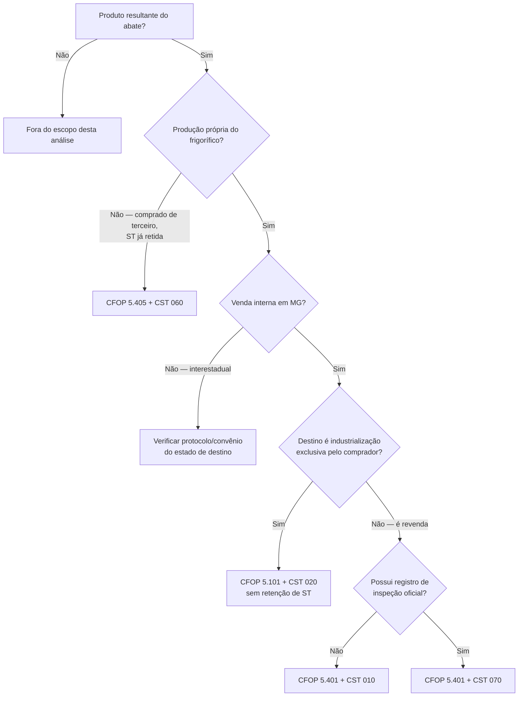
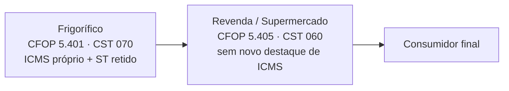

import { Callout } from 'fumadocs-ui/components/callout';
import { Card, Cards } from 'fumadocs-ui/components/card';
import { Step, Steps } from 'fumadocs-ui/components/steps';
import { Tab, Tabs } from 'fumadocs-ui/components/tabs';
import { Accordion, Accordions } from 'fumadocs-ui/components/accordion';
import { TypeTable } from 'fumadocs-ui/components/type-table';
import { FileText, ScrollText, Scale, Search, Landmark, Gavel } from 'lucide-react';

# Rotina de Frigorífico Tijuco

Análise da parametrização de CFOP e CST para venda de produção própria do frigorífico, com foco na correta aplicação do ICMS-ST em Minas Gerais.

<Callout type="error" title="Divergência identificada">
  A combinação `CFOP 5.401` + `CST 060` está **incompatível** com a operação descrita: venda interna de produção própria, com o frigorífico na condição de substituto tributário.
</Callout>

## Resumo executivo

O CFOP `5.401` identifica venda de produção própria em que o frigorífico atua como **substituto tributário**. O CST `60/060`, por outro lado, identifica quem está na condição de **substituído** — quem recebeu a mercadoria com o ICMS-ST já recolhido anteriormente. Usar os dois juntos inverte essa lógica. ([Confaz][1])

<TypeTable
  type={{
    cfop: {
      description: 'Venda interna de produção própria',
      type: '5.401',
    },
    cst: {
      description: 'Tributada com redução de base e ICMS-ST retido',
      type: '070',
    },
    cest: {
      description: 'Carnes e miudezas resultantes do abate — NCM 0201/0202/0204/0206',
      type: '17.084.00',
    },
    mva: {
      description: 'Margem de valor agregado para o cálculo do ICMS-ST',
      type: '15%',
    },
    reducao: {
      description: 'Redução da base de cálculo própria e do ICMS-ST (alíquota nominal de 18%)',
      type: '61,11%',
    },
  }}
/>

<Callout type="info">
  O `CST 060` não desaparece da cadeia — ele apenas pertence à **etapa seguinte**, quando a revenda ou o supermercado vender a mercadoria já tributada por ST.
</Callout>

---

## Por que os produtos estão sujeitos à ST em MG

O Anexo VII do RICMS/MG relaciona, no item **84.0**, os produtos comestíveis resultantes do abate de bovinos, ovinos e bufalinos, frescos, resfriados ou congelados, sob o âmbito **17.3 — interno**. ([Fazenda de Minas Gerais][2])

<TypeTable
  type={{
    cest: { description: 'Código Especificador da Substituição Tributária', type: '17.084.00' },
    ncm: { description: 'Posições abrangidas pelo item 84.0 do Anexo VII', type: '0201 · 0202 · 0204 · 0206' },
    ambito: { description: 'Aplicação da MVA de 15%', type: '17.3 — interno' },
  }}
/>

O estabelecimento industrial mineiro é responsável, como substituto tributário, pela retenção e recolhimento do imposto devido nas operações subsequentes. ([Fazenda de Minas Gerais][2])

<Callout type="success">
  Produtos classificados na posição `0206` — desde que a classificação fiscal e a descrição estejam corretas — estão abrangidos pelo CEST `17.084.00` nas vendas internas em Minas Gerais.
</Callout>

---

## Redução da base de cálculo

O art. 33 do Anexo VIII do RICMS/MG determina redução da base nas operações internas promovidas pelo estabelecimento industrializador, condicionada à localização em MG e ao registro em serviço de inspeção oficial. A redução também se aplica ao cálculo do ICMS-ST quando o industrializador for responsável pela retenção. ([Fazenda de Minas Gerais][3])

| Alíquota nominal | Redução da base | Carga efetiva aproximada |
| --- | --- | --- |
| `18%` | `61,11%` | `≈ 7%` |
| `12%` | `41,66%` | `≈ 7%` |

$$
18\% \times (100\% - 61,11\%) \approx 7\%
$$

Essa redução, combinada com a retenção do ICMS-ST, é justamente o que caracteriza o **CST 70** — tributada com redução de base e com ICMS retido por substituição tributária. ([Confaz][1])

<Callout type="warn" title="Exceção — sem registro de inspeção oficial">
  Se o frigorífico não cumprir as condições para a redução, o tratamento tenderia a ser `CFOP 5.401 + CST 010`: operação tributada normalmente, com cobrança do ICMS-ST, mas sem redução da base.
</Callout>

---

## Árvore de decisão — CFOP e CST



---

## Cadeia comercial: quem usa cada código



<Tabs items={['Frigorífico → Revenda', 'Frigorífico → Supermercado']}>
  <Tab value="Frigorífico → Revenda">
    <Steps>
      <Step>
        **Nota do frigorífico**

        `CFOP 5.401` · `CST 070` · `CEST 17.084.00` · `MVA 15%`, com destaque do ICMS próprio e cálculo/destaque do ICMS-ST, considerando a redução do art. 33.
      </Step>
      <Step>
        **Venda posterior da revenda**

        A revenda passa à condição de substituída: `CFOP 5.405` + `CST 060`, normalmente sem novo destaque de ICMS próprio, pois a tributação foi encerrada anteriormente pela ST. O CFOP 5.405 é destinado à venda de mercadoria adquirida de terceiros sujeita à ST, na condição de contribuinte substituído. ([Confaz][4])
      </Step>
    </Steps>
  </Tab>
  <Tab value="Frigorífico → Supermercado">
    A lógica é idêntica: **frigorífico** usa `5.401 + 070`, com ICMS próprio e ICMS-ST; **supermercado** usa `5.405 + 060` na venda subsequente.

    O tipo de destinatário — supermercado, açougue, distribuidor ou outra revenda — não altera o enquadramento. O que determina a regra é:

    * o frigorífico realiza a primeira saída da própria produção;
    * o comprador realizará uma operação subsequente;
    * o frigorífico recolhe antecipadamente o imposto dessa operação subsequente.
  </Tab>
</Tabs>

<Callout type="info">
  `CST 060` pertence normalmente à revenda ou ao supermercado — não ao frigorífico industrializador.
</Callout>

### Quando o frigorífico pode usar CST 060

Apenas quando estiver **revendendo**, e não industrializando, uma mercadoria adquirida de terceiro com o ICMS-ST já retido anteriormente:

<Steps>
  <Step>O frigorífico compra caixas de um produto acabado de outro fabricante.</Step>
  <Step>O fornecedor já reteve o ICMS-ST.</Step>
  <Step>O frigorífico apenas revende o mesmo produto, sem industrializá-lo.</Step>
</Steps>

Nesse caso — e apenas nele —, a combinação correta é `CFOP 5.405 + CST 060`, pois não se trata de venda de produção própria.

---

## Exemplo de cálculo

Premissas: mercadoria `R$ 100,00` · MVA `15%` · alíquota nominal `18%` · redução da base `61,11%` · sem frete, seguro ou outras despesas.

<Accordions>
  <Accordion title="ICMS da operação própria">
    ```text
    Base reduzida: 100,00 x 38,89% = 38,89
    ICMS próprio: 38,89 x 18% ~= 7,00
    ```
  </Accordion>
  <Accordion title="ICMS-ST">
    ```text
    Base presumida antes da redução: 100,00 x 1,15 = 115,00
    Base presumida reduzida: 115,00 x 38,89% = 44,72
    ICMS total presumido: 44,72 x 18% ~= 8,05
    ICMS-ST: 8,05 - 7,00 = 1,05
    ```
  </Accordion>
</Accordions>

| Componente | Valor aproximado |
| --- | --- |
| ICMS próprio | `R$ 7,00` |
| ICMS-ST | `R$ 1,05` |

<Callout type="warn">
  Na prática, a base deve considerar frete, seguro, despesas acessórias, descontos e arredondamentos previstos na legislação.
</Callout>

---

## Exceções importantes

<Accordions>
  <Accordion title="Venda para industrialização">
    A ST não se aplica quando a mercadoria é destinada a estabelecimento industrial para emprego como matéria-prima, produto intermediário ou embalagem, desde que o destinatário não comercialize a mesma mercadoria. ([Fazenda de Minas Gerais][2])

    Tratando-se de produção própria, com a redução presente: `CFOP 5.101` + `CST 020`, sem retenção do ICMS-ST. A declaração de finalidade do destinatário e sua atividade precisam ser verificadas.
  </Accordion>
  <Accordion title="Destinatário com regime especial">
    Também pode não haver retenção pelo frigorífico quando o comprador possuir regime especial que lhe atribua a condição de substituto tributário. ([Fazenda de Minas Gerais][2])
  </Accordion>
</Accordions>

---

## Atenção: NCM 0504.00.90 (bucho/buchinho)

<Callout type="error">
  O NCM `0504.00.90` **não consta** na relação do CEST `17.084.00` — que abrange apenas `0201`, `0202`, `0204` e `0206`. Não se deve aplicar esse CEST automaticamente apenas porque o produto é resultante do abate. ([Fazenda de Minas Gerais][2])
</Callout>

Para o bucho enquadrado corretamente no NCM `0504.00.90`:

* a ausência de CEST na tabela pode estar correta;
* não deve receber automaticamente `CFOP 5.401`;
* não deve receber automaticamente `CST 060` ou `070`;
* se não houver outra hipótese de ST, uma venda interna de produção própria tenderia a `CFOP 5.101 + CST 020`, aproveitando a redução do art. 33 por se tratar de produto comestível resultante do abate.

O Anexo VII menciona o código 0504.00 em regra especial envolvendo industrialização por encomenda e atacadistas de carnes — mas isso não inclui o NCM automaticamente no CEST 17.084.00. ([Fazenda de Minas Gerais][2])

<Callout type="info" title="Recomendação de implantação">
  Criar no sistema **duas regras fiscais distintas**: produtos da posição `0206` com CEST `17.084.00` e ST; e produtos da posição `0504`, submetidos a análise própria, sem herdar automaticamente a regra do CEST `17.084.00`.
</Callout>

---

## Operações interestaduais

O âmbito do CEST `17.084.00` em Minas Gerais é **17.3 — interno**: a regra mineira não torna automaticamente o frigorífico substituto nas vendas para outros estados. ([Fazenda de Minas Gerais][2]) A configuração genérica `5.401 / 6.401` precisa ser revista caso a caso.

Antes de aplicar ST interestadual, verificar:

<Steps>
  <Step>Estado de destino e existência de protocolo ou convênio.</Step>
  <Step>Legislação interna do estado destinatário.</Step>
  <Step>Inscrição estadual do frigorífico como substituto naquele estado.</Step>
  <Step>MVA original ou ajustada, e eventual regime especial.</Step>
</Steps>

| Operação interestadual | Tratamento possível |
| --- | --- |
| Sem responsabilidade por ST no destino | `6.101`, com ICMS próprio |
| Com redução de base e sem ST | `6.101 + CST 020` |
| Frigorífico responsável pela ST do destino | `6.401 + CST 070` ou `010` |
| Mercadoria adquirida com ST anterior | Analisar `CFOP 6.404` e regras do destino |

MG também prevê redução para saídas interestaduais de produtos comestíveis resultantes do abate, com percentuais de `61,11%` ou `41,66%`, conforme a alíquota aplicável. ([Fazenda de Minas Gerais][5])

<Callout type="warn">
  Não é recomendável manter `CFOP 6.401` como regra automática para qualquer venda fora de MG.
</Callout>

---

## Parecer final por classificação fiscal

<Tabs items={['NCM 0206', 'NCM 0504.00.90']}>
  <Tab value="NCM 0206">
    <TypeTable
      type={{
        cfop_5401: { description: 'Correto para venda interna de produção própria com ST', type: 'mantém' },
        cfop_6401: { description: 'Revisar por estado de destino antes de aplicar automaticamente', type: 'revisar' },
        cst_060: { description: 'Incorreto para produção própria na condição de substituto', type: 'remover' },
        cst_070: { description: 'Com redução da base e ICMS-ST — combinação recomendada', type: 'aplicar' },
        cest: { description: 'Correto para NCM 0206 abrangido pela descrição', type: '17.084.00' },
        mva: { description: 'Margem de valor agregado', type: '15%' },
        reducao_bc: { description: 'Quando a alíquota nominal for 18%', type: '61,11%' },
      }}
    />
  </Tab>
  <Tab value="NCM 0504.00.90">
    <TypeTable
      type={{
        cest: { description: 'Ausência de CEST é preliminarmente coerente', type: 'em branco' },
        cfop_5401: { description: 'Não aplicar automaticamente', type: 'não aplicar' },
        cst_070_060: { description: 'Não aplicar automaticamente', type: 'não aplicar' },
        tratamento_provavel: { description: 'Se aplicável o art. 33, sem hipótese de ST', type: '5.101 + 020' },
        pendencia: { description: 'Validar NCM, descrição e eventual regra especial', type: 'validar' },
      }}
    />
  </Tab>
</Tabs>

<Callout type="success" title="Conclusão">
  Para os produtos `0206`, a regra mais consistente é `5.401 + 070`. O `060` deve ficar reservado para a venda posterior realizada pela revenda ou pelo supermercado.
</Callout>

---

## Checklist para a contabilidade

Solicitar que a contabilidade demonstre por escrito:

<Steps>
  <Step>Quem teria recolhido anteriormente o ICMS-ST que justificaria o `CST 060`.</Step>
  <Step>Por que o frigorífico seria substituído se está usando `CFOP 5.401`, próprio de substituto.</Step>
  <Step>A fundamentação para não utilizar o `CST 070`.</Step>
  <Step>A memória de cálculo contendo `pRedBC`, `vBC`, `vICMS`, `pMVAST`, `pRedBCST`, `vBCST` e `vICMSST`.</Step>
  <Step>O tratamento separado dos itens NCM `0206` e `0504.00.90`.</Step>
</Steps>

---

## Referências oficiais

<Cards>
  <Card icon={<ScrollText />} title="Anexo VII do RICMS/MG" href="https://www.fazenda.mg.gov.br/empresas/legislacao_tributaria/ricms2023/anexovii2023.pdf" description="Regras de substituição tributária e relação CEST/NCM" />
  <Card icon={<ScrollText />} title="Anexo VIII do RICMS/MG" href="https://www.fazenda.mg.gov.br/empresas/legislacao_tributaria/ricms2023/anexoviii2023.pdf" description="Art. 33 — tratamento tributário da carne e derivados" />
  <Card icon={<Scale />} title="Tabela oficial de CST do ICMS" href="https://www.confaz.fazenda.gov.br/legislacao/ajustes/2023/ajuste-sinief-39-23" description="Diferença entre CST 60 e CST 70" />
  <Card icon={<Scale />} title="Tabela oficial de CFOP" href="https://www.confaz.fazenda.gov.br/legislacao/ajustes/sinief/cfop_cvsn_70_vigente" description="5.401, 5.405, 6.401 e demais códigos" />
  <Card icon={<Search />} title="Pesquisa avançada do RICMS/MG" href="https://www.fazenda.mg.gov.br/empresas/legislacao_tributaria/ricms_pesquisa/" description="Busca de dispositivos do regulamento" />
  <Card icon={<Landmark />} title="Consulta de regimes especiais" href="https://www.fazenda.mg.gov.br/empresas/legislacao_tributaria/regime_especial/" description="Regimes especiais da SEF/MG" />
  <Card icon={<Gavel />} title="Decisão do Conselho de Contribuintes" href="https://www.fazenda.mg.gov.br/secretaria/conselho_contribuintes/acordaos/2025/3/25355253.pdf" description="Caso recente envolvendo produtos alimentícios e ICMS-ST" />
</Cards>

[1]: https://www.confaz.fazenda.gov.br/legislacao/ajustes/2023/ajuste-sinief-39-23 "AJUSTE SINIEF 39/23 — Conselho Nacional de Política Fazendária CONFAZ"
[2]: https://www.fazenda.mg.gov.br/empresas/legislacao_tributaria/ricms2023/anexovii2023.pdf "Anexo VII - 2023"
[3]: https://www.fazenda.mg.gov.br/empresas/legislacao_tributaria/ricms2023/anexoviii2023.pdf "Anexo VIII - 2023"
[4]: https://www.confaz.fazenda.gov.br/legislacao/ajustes/sinief/cfop_cvsn70_vigente_01-06-22_31-03.24 "CFOP_CVSN_1.6.22_31.03.24 - Confaz"
[5]: https://www.fazenda.mg.gov.br/empresas/legislacao_tributaria/ricms2023/anexoii2023.pdf "Anexo II - 2023"
[6]: https://legisfacil.fazenda.mg.gov.br/ricms - "RICMS/MG — Legislação consolidada"
